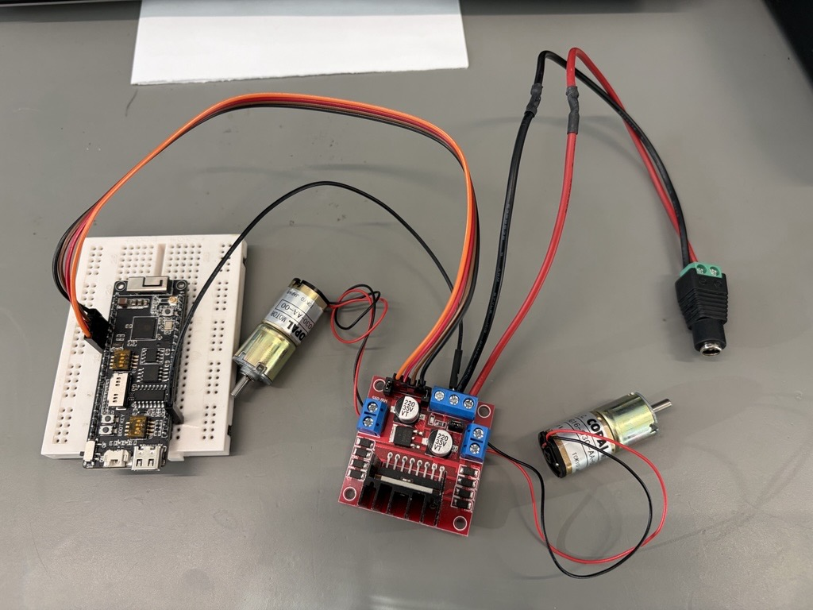
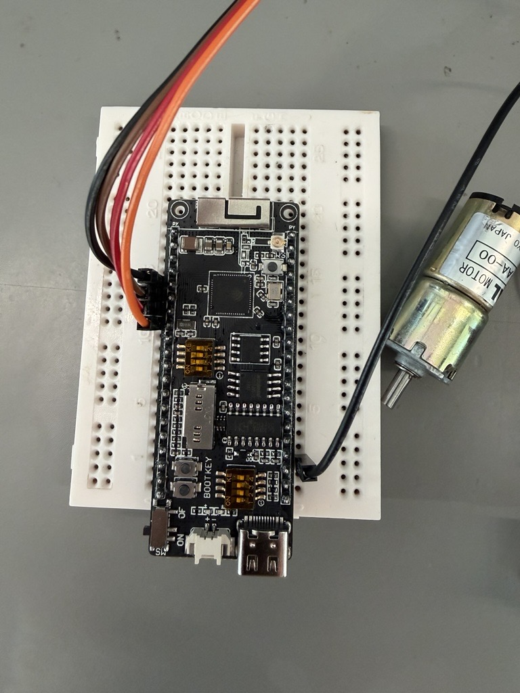

# ESP32-S2 witn H-Bridge module

A showcase of moving DC motors with H-bridge module in Arduino plarform and MicroPython on ESP32-S2 board.

 

## Core idea - PWM control

- Control speed with PWM through IN1、IN2、IN3、IN4
- Implement PWM on ESP32 only with **ledcWrite(pin_num, speed)**, not analogWrite()!!

 

## Hardware

### HW-095

- **H-Bridge** module with **L298N** chip

### ESP32-S2

- [**LilyGO ESP32-S2**](https://www.tinytronics.nl/en/development-boards/microcontroller-boards/with-wi-fi/lilygo-ttgo-t8-esp32-s2-with-sd-card-slot)

### 2 x DC motors

### Power source: 12V x 2A

### Wiring

- 5V-GND-12V on HW-095
  - 5V：For output mainly, and provide power for logic control of the module. Keep the 2 pins for \
    5V (closed) connected.
  - GND：Ground pin, GND of ESP32-S2 board and external power supply have to be connected \
    together here.
  - 12V：Input of external power source.
- Control
  - IN1、IN2 for OUT1、OUT2
  - IN3、IN4 for OUT3、OUT4
  - For using PWM, ENA / ENB have to be connected with the 5V pins above both the pins
- Pins：
  - 4、5、6、7 to IN1、IN2、IN3、IN4

### 照片

 

## QA

- Use external power source of 5V? \
  L298N has huge decrease of voltage due to the design, which is about 2V, this means if external power source \
  is 5V, the logic circuit of the module will only get less than 4V to start working properly!! So, the external power \
  must provide power over 6V at least!
