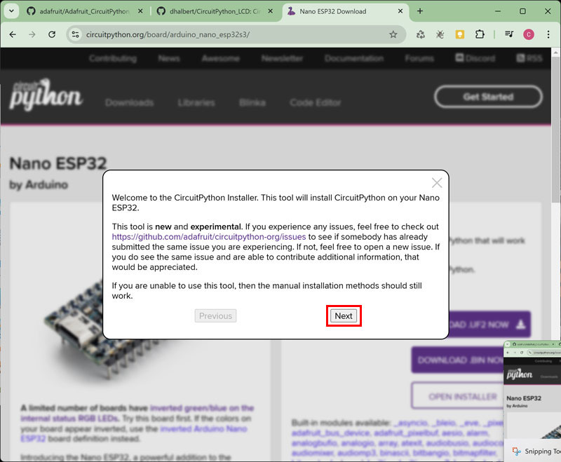
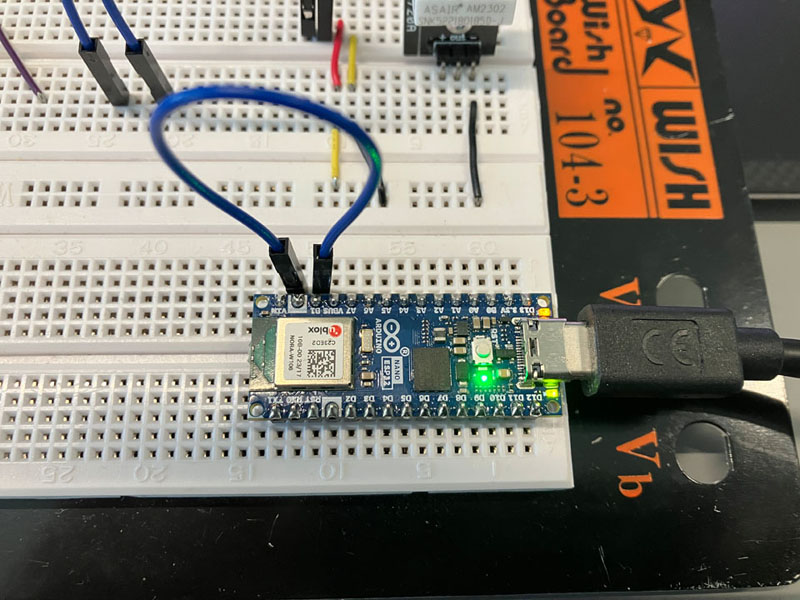

# Turn an Arduino Nano ESP32 into a pyboard of CircuitPython

This article shows how to flash an Arduino Nano ESP32 to a pyboard in CircuitPython via [offcial product page](https://circuitpython.org/board/arduino_nano_esp32s3/)

 

## Preparation

1. Arduino Nano ESP32

2. A jumper wire for shortage GND and B1 pin

 

## Flash Arduino Nano ESP32 into a pyboard

1. Connect Arduino Nano ESP32 and switch it to **programming mode** - the onboard LED will be **dark purple** - [here shows how to](#how-to-switch-arduino-nano-esp32-to-programming-mode) 

2. Open [offcial product page](https://circuitpython.org/board/arduino_nano_esp32s3/), and click "**OPEN INSTALLER**" below the **DOWNLOAD** buttons 

3. Choose "**Install CircuitPython 9.2.4 Bin Only**", the version will change by the updating of CircuitPython 

4. "**Next**" 

5. "**Connect**" 

6. Choose the correct COM port, and click "**Connect**" to get Arduino Nano ESP32 connected.  
On windwos, you can always check the COM port via "**Device Manager**" -> Ports (COM & LPT)  

7. Choose "**Continue**" to start writing firmware 

8. Processing...  

9. "**Close**" and done. Then the "**CIRCUITPY**" folder of the pyboard storage will pop up  

 

## Usage

The pyboard would automatically execute the files named with "**code.py**" after it starts up, so place the codes, which needs to  
be executed automatically, into the file.

 

### Check MAC address

Check the MAC address of the board in the CircuitPython console with the commands below:

<pre>
# check MAC address of the board
>>> import wifi
>>> print("My MAC addr:", [hex(i) for i in wifi.radio.mac_address])

# output example, the exact MAC address should be 34:85:18:7a:e6:6c
My MAC addr: ['0x34', '0x85', '0x18', '0x7a', '0xe6', '0x6c']
</pre>

### How to copy a file to pyboard with Thoony

[Please check here](../ESP32_to_Pyboard/README.md#how-to-copy--upload-a-file--folder-to-pyboard-with-thoony)

## Recover an ESP32 pyboard as a normal ESP32 for Arduino

Try to upload any Arduino code to the ESP32 pyboard, then test whether the ESP32 is working as an Arduino ESP32.

 

## Others

### How to switch Arduino Nano ESP32 to programming mode?

1. Connect Arduino Nano ESP32 to computer 

2. Short the GND and B1 pins with jumper wire, they are right next to each other, then the onboard LED will turn to **GREEN**  

3. Click the RST button, the onboard LED stays **GREEN** 

4. Remove the jumper wire for shortage B1 and GND pins, then the onboard LED will turn to **DARK PURPLE**  

1. Done, and the window named "CIRCUITPY" for the storage of the board will pop up

### Reference

* [Official CircuitPython Page](https://circuitpython.org/)

* [Programming in CircuitPython](https://learn.adafruit.com/welcome-to-circuitpython)
