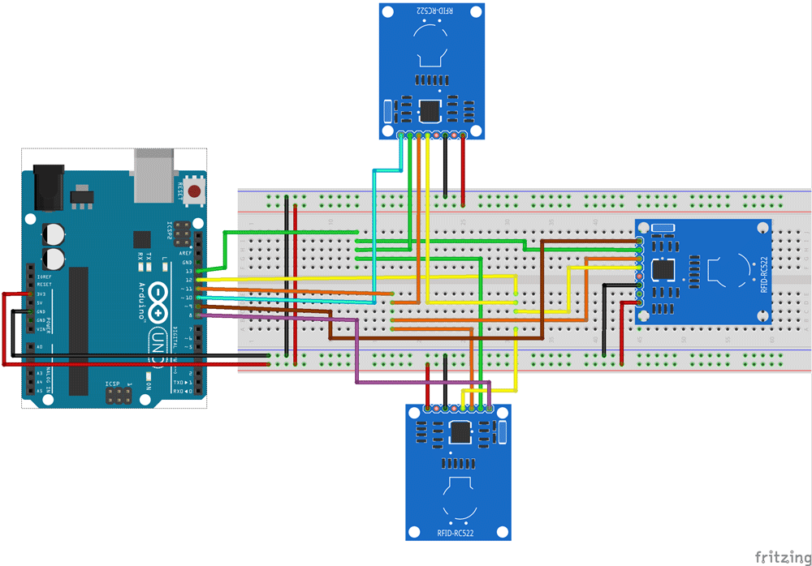

# MFRC522
- [What is RFID ? NFC?](https://www.techtarget.com/iotagenda/definition/RFID-radio-frequency-identification)
<br><br>
## Connect multiple RC522 modules to an Arduino Uno

<br>

### Requirement

To connect 3 RC522 RFID modules with an Arduino Uno board, you will need the following materials:
```text
- 3 RC522 RFID modules
- 1 Arduino Uno board
- Jumper wires
- Breadboard
```
<br>

### Steps

1. Connect each RC522 module to the Arduino Uno board using the following connections:
    ```text
        - SDA pin of the RC522 modules to digital pins 10, 9, and 8 of the Arduino Uno board for the first, second, and third modules respectively.
        - SCK pin of the RC522 modules to digital pins 13.
        - MOSI pin of the RC522 modules to digital pins 11.
        - MISO pin of the RC522 modules to digital pins 12.
        - IRQ pin of the RC522 modules to digital pins 2 (if necessary).
        - VCC pin of the RC522 modules to the 3.3V pin of the Arduino Uno board.
        - GND pin of the RC522 modules to the GND pin of the Arduino Uno board.
    ```

2. Modify the example "ReadUidMultiReader" sketch in Arduino IDE (File > Examples > MFRC522 > ReadUidMultiReader) to initialize and use each of the three RC522 modules. You will need to create three separate instances of the MFRC522 class, one for each module. Modify the pin numbers in the initialization code to match the pins you used to connect the modules.

3. Upload the modified sketch to your Arduino Uno board.

<br>
Once you have completed these steps, you should be able to use all three RC522 modules simultaneously. You can test this by placing RFID tags in the field of each of the three modules and observing the output in the serial monitor.

<br>

## Attention

1. The wirings motioned in Step 2 is different from what's in the example code, check carefully before uploading the code, otherwise the readers might not work properly.

2. If the reader can't read RFID tokens properly, try different combinations of the readers and tokens first, some readers can only identify specified tokens.

<br>

## A schematic diagram of the connection is shown as following: