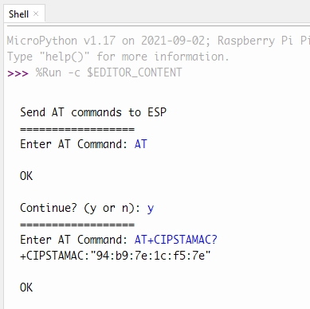
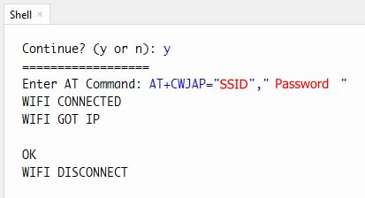
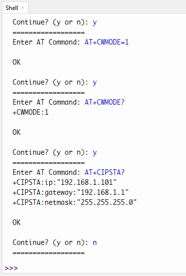
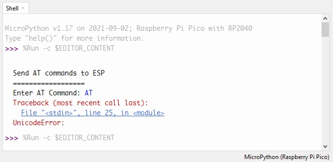
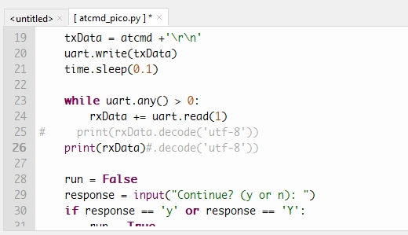
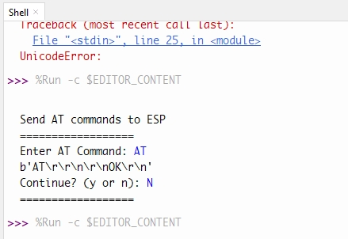
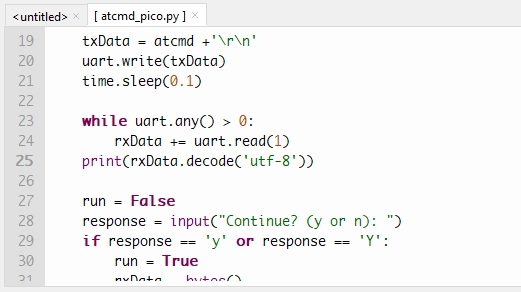
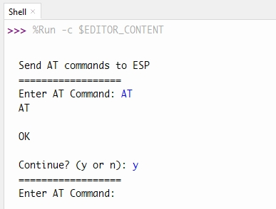

### Description

In this demo, Raspberry Pi Pico will connect to the Internet with the WiFi module, ESP-12S, and fetch online information via GET and POST requests.

### Preparation

1. First, combine ESP-12S module and the **[breakout](https://www.tinytronics.nl/shop/en/tools-and-mounting/prototyping-supplies/breakout-boards/esp8266-wifi-module-esp-12-breakout-board)** with soldering works

2. Connections between ESP-12S module and Raspberry Pi Pico:

   Pinout references: [ESP-12S](images/ESP-12s_pinout.jpg), [Raspberry Pi Pico](images/RPi_Pico_pinout-800x576.jpg)
   |Pins of ESP-12S module|Pins of Raspberry Pi Pico|
   |---|---|
   |VCC|VCC (3.3V)|
   |GND, GPIO15|GND|
   |RXD(GPIO3)|UART0 TX(GPIO0)|
   |TXD(GPIO1)|UART0 RX(GPIO1)|

3. Save the files to RPi Pico: [how to save files into RPi Pico with Thonny Python IDE](https://github.com/edenchiang/PlayWithDataFoundry/tree/master/examples/ESP32_to_Pyboard#how-to-copy-a-file-to-pyboard-with-thoony)

4. Make sure ESP-12S module is working properly in client mode:

   1. Connect ESP-12S module and Raspberry Pi Pico with the pin setting above
   2. Open [Thonny](https://thonny.org/) and execute [atcmd_pico.py](atcmd_pico.py)
   3. Enter these AT commands in the Shell window and check:

      - AT : check whether the AT command is working or not
      - AT+CIPSTAMAC? : Get MAC address of ESP-12S module if needed

      

      - AT+CWJAP="SSID","PASSWORD" : Try to connect ESP-12S module to the Internet

      

      - AT+CWMODE=1 : Set ESP-12S module work as a WiFi client
      - AT+CIPSTA? : Check the IP address of ESP-12S module if needed

      

      - [AT commands reference](http://room-15.github.io/blog/2015/03/26/esp8266-at-command-reference/)

   4. Troubleshooting:

      - If there is the same error as below:

      

      1. Update the code in line 25 and 26 as below, then execute the atcmd_pico.py again, and try to enter some AT commands in Shell window

      

      The result of AT commands should be like this:

      

      2. Recover the code in line 25 as below, and try to execute the atcmd_pico.py, and try to enter some AT commands

      

      The AT commands should work now:

      

### Process

1. Open "[esp8266_test.py](esp8266_test.py)" from the Pico and enter the correct SSID and password in line 48

2. Run the python script

3. [Code reference](https://github.com/Circuit-Digest/rpi-pico-micropython-esp8266-lib)
   - In this reference, the WiFi module is ESP-01, but the code works fine with ESP-12S for the same ESP8266 chip with the same pin setting
