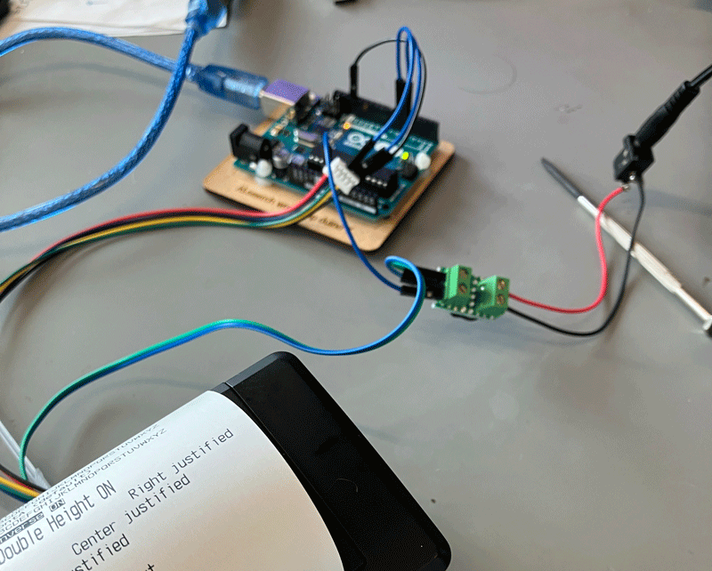
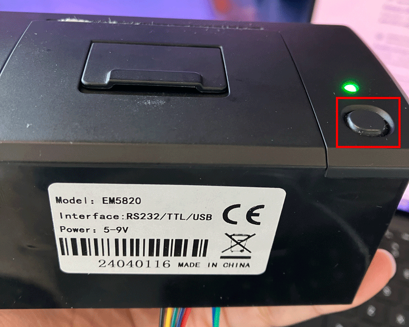
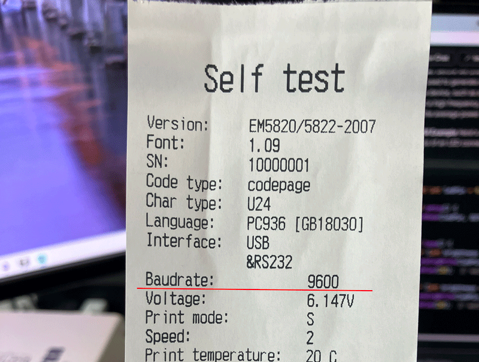
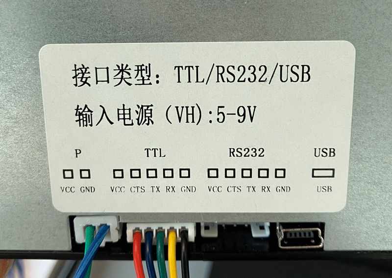
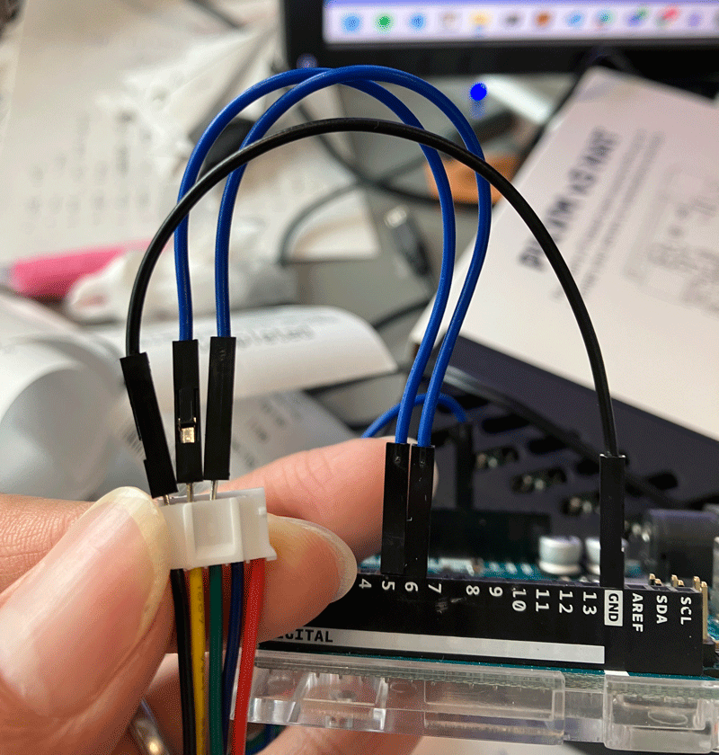

# Thermal printer #EM5820

This is an use case with Arduino Uno / ESP32 to output data via a thermal printer #EM5820.  
In this case, I use SoftwareSerial library for Uno, and third HardwareSerial on ESP32 to transfer data to printer.

 

## Hardware

- An Arduino Uno / ESP32 board
- An external DC power supply for **5V - 9V**, what I have here is 6V x 1.5A
- Thermal printer #**EM5820**

 

## Software

- **Arduino IDE**
  - with **Adafruit_Thermal** library installed
- For Uno, **SoftwareSerial** library is required
- For ESP32, I use **OOCSI** library as an example to fetch data and print the content

 

## How to make it work

### Baudrate check

The self test page can be printed with a long press of the only button on the printer. It shows current information of the device, includes model (version in the test page), baudrate, working voltage now, and some test characters. Where the button is:

It's always good to get the actual baudrate of the printer to make sure your data would be recognized correctly.

### Wiring

- External power supply:
  - positive (+) : Connect to the VCC pin of printer
  - negetive (-) : Connect to GND pin of Uno / ESP32 and the GND pin on the **P** socket
- Thermal printer:
  
  - (P) ower pins:
    - VCC: Connect to external power supply positive (+)
    - GND: Connect to external power supply negative (-) and GND pin of Uno / ESP32
  - (TTL) pins: The following photo is a show case with Uno.
    
    - VCC: Not used
    - CTS: Not used
    - TX: Connect to the **Tx** pin set in the code
    - RX: Connect to the **Rx** pin set in the code
    - GND: Connect to GND pin of Uno / ESP32

- ***IMPORTANT***:
  - GND pins on both external power supply and printer have to be connected to the GND pin(s) on Uno / ESP32
  - The connection of TX/RX here is **reversed** compared to general case!! Which means that we have Tx-Tx and Rx-Rx here, instead of Tx-Rx and Rx-Tx.

### Run the code

- Upload the example code via Arduino IDE according to your platform
- For Uno, just open the serial monitor on Arduino IDE and enter something, then what you input should be output to the paper.
- For ESP32, you have to open the [UI client tool on OOCSI page](https://oocsi.id.tue.nl/test/visual), set channel name as what you have in your code on the right hand side column, and click the **SEND** button. Then wait, there should be something come out from the printer.

 
